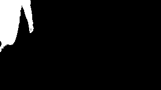

# Kya Badla?

Zero-point-five dependency (OpenCV is used solely for container classes and to load frames, and ArgParse is used only to, well, parse arguments) computer vision project that takes a 'video' as output and outputs another video highlighting 'change' in the original video's foreground, and gradually 'removing' it via alpha-blending.

Just about everything in terms of actual classical CV algorithms has been done from scratch, with, to the best of my ability and patience, modern C++ practices.

## Frame Progression

| Mean Calculation                                              | Variance Calculation                                                  |
| ------------------------------------------------------------- | --------------------------------------------------------------------- |
|  |  |

| Grayscale                                          | Mask                                               | Mask Opened                                               | Blended                                             |
| -------------------------------------------------- | -------------------------------------------------- | --------------------------------------------------------- | --------------------------------------------------- |
|    |    |    |    |
|  |  |  |  |
|  |  |  |  |
|  |  |  |  |

## Usage

```bash
git clone https://github.com/masroof-maindak/kya-badla.git
cd kya-badla
mkdir build && cd build
cmake -DCMAKE_BUILD_TYPE=Release .. # Or 'Debug' if you want to hack away.
cmake --build .
./kybdl -i <input-dir> -o <output-dir> # Or maybe try `-h` first
```

## Command Line Arguments

| Short Flag | Long Flag                 | Description                                                                   | Default Value | Choices        | Required |
| :--------- | :------------------------ | :---------------------------------------------------------------------------- | :------------ | :------------- | :------- |
| `-o`       | `--output-dir`            | specify the output dir                                                        |               |                | Yes      |
| `-i`       | `--input-dir`             | specify the input dir                                                         |               |                | Yes      |
| `-ie`      | `--input-ext`             | specify the input frames' extension                                           | `.png`        | `.png`, `.jpg` | No       |
| `-oe`      | `--output-ext`            | specify the output frames' extension                                          | `.png`        | `.png`, `.jpg` | No       |
| `-vf`      | `--video-format`          | specify the output video's extension                                          | `.mp4`        | `.mp4`, `.avi` | No       |
| `-rs`      | `--resize-scale`          | specify the input frames' scale post-resizing -- (0 - 1)                      | `1.0f`        |                | No       |
| `-fss`     | `--frame-save-step`       | specify the number of frames after which a new frame will be saved            | `10`          |                | No       |
| `-fc`      | `--frame-count`           | specify the first #N frames to use for background generation                  |               |                | No       |
| `-mt`      | `--mahalanobis-threshold` | specify the threshold to be used to compute the mask via Mahalanobis Distance | `5`           |                | No       |
| `-ks`      | `--kernel-size`           | specify the size of the kernel to be used for dilation/erosion                | `3`           |                | No       |
| `-mi`      | `--iterations`            | specify the number of iterations the morphological operations should run for  | `1`           |                | No       |
| `-r`       | `--remove-via-blend`      | specify whether to (attempt to) remove the foreground                         | `false`       |                | No       |

## Features

- Robust set of command-line arguments
- Grayscale conversion
- Mean & variance calculation
- Mahalanobis distance-based foreground-masking
- Mask opening (erosion + dilation)
- Alpha blending to remove foreground subject
- Save video w/ subject removed

## Assumptions

- \[\*\] The 'video' lies as image frames inside the input directory
- The ordering b/w frames is reflected by their names in ascending order e.g `frame00000.png`
- Each frame has 3 8-bit channels

## Dependencies

- OpenCV
- QT6
- VTK
- HDF5

#### Arch Linux

```bash
sudo pacman -S opencv qt6-base vtk hdf5
```

## Acknowledgements

- [ArgParse](https://github.com/p-ranav/argparse)
