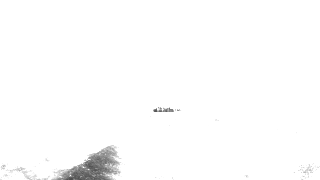

# Kya Badla?

Zero-point-five dependency (OpenCV is used solely for container classes and to load frames, and ArgParse is used only to, well, parse arguments) computer vision project that takes a 'video' as output and outputs another video highlighting 'change' in the original video's foreground, and gradually 'removing' it via alpha-blending.

Just about everything in terms of actual classical CV algorithms has been done from scratch, with, to the best of my ability and patience, modern C++ practices.

## Frame Progression

| Mean Calculation                                              | Variance Calculation                                                  |
| ------------------------------------------------------------- | --------------------------------------------------------------------- |
|  |  |

| Grayscale                                          | Mask                                               | Mask Opened                                               | Blended                                             |
| -------------------------------------------------- | -------------------------------------------------- | --------------------------------------------------------- | --------------------------------------------------- |
|    |    |    |    |
|  |  |  |  |
|  |  |  |  |
|  |  |  |  |

## Usage

```bash
git clone https://github.com/masroof-maindak/kya-badla.git
cd kya-badla
mkdir build && cd build
cmake -DCMAKE_BUILD_TYPE=Release .. # Or 'Debug' if you want to hack away.
cmake --build .
./kybdl -i <input-dir> -o <output-dir>
```

## Features

- Robust set of command-line arguments
- Grayscale conversion
- Mean & variance calculation
- Mahalanobis distance-based foreground-masking
- Mask opening (erosion + dilation)
- Alpha blending to remove foreground subject
- Save video w/ subject removed

## Assumptions

- \[\*\] The 'video' lies as image frames inside the input directory
- The ordering b/w frames is reflected by their names in ascending order e.g `frame00000.png`
- Each frame has 3 8-bit channels

## Dependencies

- OpenCV
- QT6
- VTK
- HDF5

#### Arch Linux

```bash
sudo pacman -S opencv qt6-base vtk hdf5
```

## Acknowledgements

- [ArgParse](https://github.com/p-ranav/argparse)
